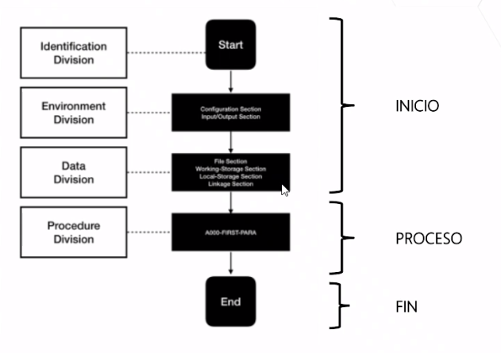
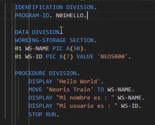
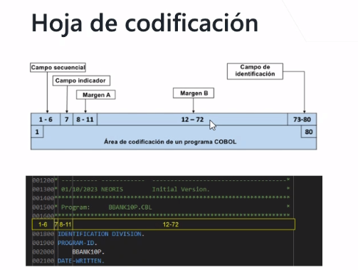
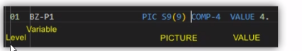
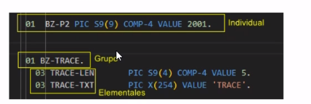
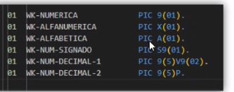
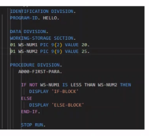
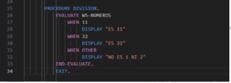

1. ¿Que obtendras de este curso?
   Comprenderemos los conceptos fundamentales de los sistemas mainframe y su relevancia en el mundo empresarial actual
   Aprenderemos a utilizar VSCode como entorno de desarrollo
   Adquiriremos habilidades en programación, COBOL, JCL, DB2 y CICS, aplicables a proyectos mainframe.
   Exploraremos la integración de herramientas de control de versiones Git y plataformas de colaboración como Bitbucket en tu flujo de trabajo.
   Conoceremos procesos de compilación y despliegue mediante el uso de herramientas CI/CD para una integración continua efectiva

El mainframe, una computadora de alto rendimiento con gran capacidad de memoria y procesamiento, ha sido una parte fundamental de la tecnología desde la decada de 1940. Si bien las computadoras personales son la solución ideal por muchos factores, siendo el costo uno de los más importantes, nunca pueden igualar la velocidad de procesamiento, la conectividad multiusuarios y la confiabilidad que ofrecen los mainframes.

Caracteristicas:

Seguridad -> Tienen capacidades avanzadas de seguridad integradas, incluyendo autenticación, autorización y cifrado de datos.

Velocidad de procesamiento.

En el pasado, los metodos de entrada y salida se basaban en tarjetas microperforadas, una lejana alternativa a los actuales teclados, ratones y pantallas. La información se cifraba y registraba en estas tarjetas mediante pequeños agujeros fisicos, los cuales el ordenador detectaba y leia mediante un codigo. Despues de llevar a cabo las opoeraciones designadas, el ordenador generaba otra tarjeta perforada que exhibia los resultados obtenidos.

El mark I, el primer computadro al que IBM llamo "Mainframe" la entrada de datos se efectuaba mediante tarjetas microperforadas, aunque tambien sepermitia la adición de información mediante papel. En cuanto a la salida, se llevaba a cabo mediante tarjetas microperforadas o de forma automatizada, ya sea directamente en papel mediante maquinas de escribir mecanicas

Que lenguaje usa el mainframe?

1. Cobol (Common Business-Oriented Language) especialmente en aplicaciones financieras y empresariales.
2. Assembler: arquitectura del mainframe IBM.
3. La base de datos introducida en cobol.

Tipos de programación

El pseudocodigo esuna representación intermedia entre el lenguaje humano y el de programación real.

Legibilidad: El pseudocodigo esta diseñado para que sea fácil de entender uso de palabras clave en lugar de sintaxis exacta.

Se utiliza programación estructurada.

Divisiones de un programa cobol

Hay 4 secciones necesarias para un programa COBOL

Identification Division (trae quien lo creo y el nombre de programa)

Environment Division (si no hay a archivos de entrada ni salida no es necesario)

Data Division (Variables y conexión aotros programas)

Procedure Division (Se realiza toda la logica)

Aquí hay un ejemplo de codigo:

Hoja de codificación

Dividimos todo en columnas, segun en que columna este cada valor, podemos darle diferentes significados

En el margen B va toda la logica del programa, en el A los nombres de la acción.

La columna 7 es para los comentarios, poniendo un asterisco en esa linea y escribiendo arriba

Tipos de funciones:

Display: muestra un mensaje de cualquier tipo en pantalla

Move: mueve el valor de una variable a otra

Variables

Nivel: 01-> Identifica la primera entrada de un campo (puede subdividirse de 2 a 46)

Nivel 02 a 49 -> Indican las subdivisiones dentro de las estructuras

77 -> Indifcan elementos que no pueden ser subdivididos

66 -- 88 -> Indica posibles valores que se pueden almacenar en la variable

Tipos de datos:

Numeros decimales, con una V9 le tomamos la cantidad de decimales (en el ejemplo 5 numeros y 2 decimales)

En estos casos, vemos como asignamos valores.

Condiciones

Tanto IF como Evaluate evaluan situaciones

No se pueden usar mas de 3 if anidados, se recomienda utilizar Evaluate para esos casos
